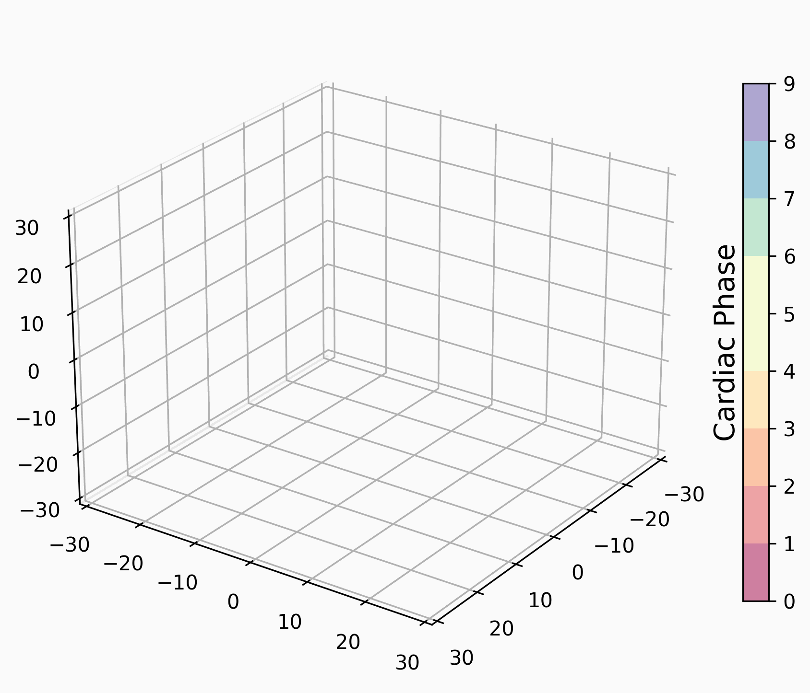

# Towards Cardiac MRI Foundation Models: Comprehensive Visual-Tabular Representations for Whole-Heart Assessment and Beyond

Yundi Zhang, Paul Hager, Che Liu, Suprosanna Shit, Chen Chen, Daniel Rueckert, and Jiazhen Pan

This repository contains the code used in the research paper: [Towards Cardiac MRI Foundation Models: Comprehensive Visual-Tabular Representations for Whole-Heart Assessment and Beyond](https://arxiv.org/abs/2504.13037).


<p align="center">
  
  
</p>

<div style="text-align: center;">
  
</div>


## Description
In this project, we introduce a multimodel framework ***ViTa*** for a comprehensive, patient-specific understanding of cardiac health. By integrating rich **3D+T cine CMR data** (from both short-axis and long-axis views) with **detailed tabular health records** from **42,000 UK Biobank participants**, ViTa enabels context-aware representation learning that supports a wide range of cardiac and metabolic health tasks in a **singed unified framework**. 

Key features include:
- Multimodal Integration: Combines CMR imaging with patient-level health indicators (e.g., sex, BMI, smoking status) for holistic cardiac assessment.

- Rich Spatio-temporal Imaging: Utilizes 3D+T cine stacks from multiple anatomical views for complete cardiac cycle representation.

- Unified Framework: Supports Multi-plane/multi-frame cardiac MRI segmentation, phenotype prediction, and disease classification within the same model.

ViTa marks a step toward foundation models for cardiology -- informative, generalizable, and grounded in patient context.

## Table of Contents
- [Installation](#installation)
- [Data File Structure](#data-file-structure)
- [Usage](#usage)
- [License](#license)
- [Contact](#contact)

## Installation

To get a local copy up and running, follow these steps:

#### Prerequisites
Before you begin, ensure you have met the following requirements:
- **Python 3.9+** as the programming language.
- **Conda** installed (part of the Anaconda or Miniconda distribution).
- **pip** installed for package management.
- **Git** installed to clone the repository.

#### Steps

1. **Clone the repository**
    ```bash
    git clone https://github.com/Yundi-Zhang/ViTa.git
    cd ViTa
    ```

2. **Create and activate a Conda environment**
    ```bash
    # Create a new Conda environment with Python 3.9 (or your required version)
    conda create --name vita python=3.9

    # Activate the Conda environment
    conda activate vita
    ```

3. **Install dependencies**
    ```bash
    pip install torch==2.0.1+cu117 torchvision==0.15.2+cu117 torchsummary -f https://download.pytorch.org/whl/torch_stable.html
    pip install -r requirements.txt
    ```

4. **Configure environment variables**
    Update the necessary environment variables in `.env`.


## Data File Structure
This project uses NIfTI files to store imaging data. For each subject, the data is organized in a specific folder structure with various NIfTI files for different types of images and their corresponding segmentations.

#### File Organization

For each subject, the data is contained in a single folder. The folder includes:

- **Short-axis (SAX) Images:**
  - `sa.nii.gz`: The short-axis images.
  - `seg_sa.nii.gz`: The segmentation maps for the short-axis images.

- **Long-axis (LAX) Images:**
  - `la_2ch.nii.gz`: The long-axis images in the 2-chamber view.
  - `la_3ch.nii.gz`: The long-axis images in the 3-chamber view.
  - `la_4ch.nii.gz`: The long-axis images in the 4-chamber view.

#### Example Directory Structure

Here is an example of how the data should be organized for one subject:
```bash
data/
│
└── subject1/
    ├── sa.nii.gz
    ├── seg_sa.nii.gz
    ├── la_2ch.nii.gz
    ├── la_3ch.nii.gz
    └── la_4ch.nii.gz
```
#### Processed image data
This project uses `.npz` files to store processed image data. Each `.npz` file contains a dictionary with specific keys, where each key corresponds to a NumPy array. The arrays have the shape `(H, W, S, T)` where  S is the number of slices in the volume. Each `.npz` file contains the following keys:

- **`sax`**: Short-axis images.
- **`lax`**: Long-axis images.
- **`seg_sax`**: Segmentation maps for short-axis images.
- **`seg_lax`**: Segmentation maps for long-axis images.

#### Example Structure of preprocessed data

The `.npz` file contains a dictionary like this:

```python
{
  "sax": np.array of shape (H, W, S, T),
  "lax": np.array of shape (H, W, S, T),
  "seg_sax": np.array of shape (H, W, S, T),
  "seg_lax": np.array of shape (H, W, S, T)
}
```
#### Processed tabular data

Please make sure to run the files in **`datasets/preprocessing_tabular`** to preprocess that tabular data.

## Usage
This project supports four tasks: 
- Pretraining (stage I + II),
- Phenotype prediction,
- Disease classification,
- Segmentation. 

Follow the instructions below to run the application for each task:

#### Stage I pretraining via image reconstruction
Replace the `cmr_path_pickle_name, subj_ids_with_required_size_pickle_name` in config file `mae_reconstruction.yaml` with your own file names.
```bash
source .env
python3 main.py train \
-c ./configs/imaging_model/mae_reconstruction.yaml \
-m imaging \
-g your_wandb_group_name \
-n your_wandb_job_name
```
#### Stage II pretraining via contrastive learning of imaging and tabular representations
Replace the `cmr_path_pickle_name, subj_ids_with_required_size_pickle_name, tabular_data, labels, imaging_ckpt_path` in config file `pretraining_imaging_tabular_CL.yaml` with your own file names and path directory.
```bash
source .env
python3 main.py train \
-c ./configs/imaging_tabular_model/pretraining_imaging_tabular_CL.yaml \
-m imaging_tabular \
-g your_wandb_group_name \
-n your_wandb_job_name
```
#### Downstream task: phenotype prediction
Replace the `cmr_path_pickle_name, subj_ids_with_required_size_pickle_name, tabular_data, raw_tabular_data, labels, imaging_ckpt_path` in config file `vita_phenotype_prediction.yaml` with your own file names and path directory.
```bash
source .env
python3 main.py train \
-c ./configs/imaging_tabular_model/vita_phenotype_prediction.yaml \
-m imaging_tabular \
-g your_wandb_group_name \
-n your_wandb_job_name
```
#### Downstream task: disease classification
Replace the `cmr_path_pickle_name, subj_ids_with_required_size_pickle_name, tabular_data, raw_tabular_data, labels, imaging_ckpt_path` in config file `vita_classification.yaml` with your own file names and path directory.
```bash
source .env
python3 main.py train \
-c ./configs/imaging_tabular_model/vita_classification.yaml \
-m imaging_tabular \
-g your_wandb_group_name \
-n your_wandb_job_name
```
#### Downstream task: segmentation
Replace the `cmr_path_pickle_name, subj_ids_with_required_size_pickle_name` in config file `mae_segmentation.yaml` with your own file names.
```bash
source .env
python3 main.py train \
-c ./configs/mae_segmentation.yaml \
-m imaging \
-g your_wandb_group_name \
-n your_wandb_job_name
```


## License
This project is licensed under the MIT License - see the [LICENSE](LICENSE) file for details.

## Contact
For questions or suggestions, contact [yundi.zhang@tum.de](mailto:yundi.zhang@tum.de) or [jiazhen.pan@tum.de](mailto:jiazhen.pan@tum.de). If you use this code in your research, please cite the above-mentioned paper.
