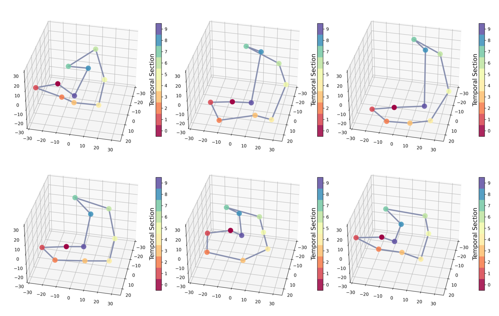

# Towards Cardiac MRI Foundation Models: Comprehensive Visual-Tabular Representations for Whole-Heart Assessment and Beyond

Yundi Zhang, Paul Hager, Che Liu, Suprosanna Shit, Chen Chen, Daniel Rueckert, and Jiazhen Pan

This repository contains the code used in the research paper published in Medical Image Analysis: [Towards Cardiac MRI Foundation Models: Comprehensive Visual-Tabular Representations for Whole-Heart Assessment and Beyond](https://arxiv.org/abs/2504.13037).


<p align="center">
  
  
</p>

<div style="text-align: center;">
  
</div>


## Description
In this project, we introduce a multimodel framework ***ViTa*** for a comprehensive, patient-specific understanding of cardiac health. By integrating rich **3D+T cine CMR data** (from both short-axis and long-axis views) with **detailed tabular health records** from **42,000 UK Biobank participants**, ViTa enabels context-aware representation learning that supports a wide range of cardiac and metabolic health tasks in a **singed unified framework**. 

Key features include:
- Multimodal Integration: Combines CMR imaging with patient-level health indicators (e.g., sex, BMI, smoking status) for holistic cardiac assessment.

- Rich Spatio-temporal Imaging: Utilizes 3D+T cine stacks from multiple anatomical views for complete cardiac cycle representation.

- Unified Framework: Supports Multi-plane/multi-frame cardiac MRI segmentation, phenotype prediction, and disease classification within the same model.

ViTa marks a step toward foundation models for cardiology -- informative, generalizable, and grounded in patient context.

## Table of Contents
- [Installation](#installation)  
- [Data](#data)  
- [Usage](#usage)  
  - [Pretraining](#1-pretraining)  
  - [Downstream Tasks](#2-downstream-tasks)  
- [Data Structure](#data-structure)  
- [License](#license)  
- [Contact](#contact) 

## Installation

To get a local copy up and running, follow these steps:

#### Prerequisites
Before you begin, ensure you have met the following requirements:
- **Python 3.9+** as the programming language.
- **Conda** installed (part of the Anaconda or Miniconda distribution).
- **pip** installed for package management.
- **Git** installed to clone the repository.

#### Steps

1. **Clone the repository**
    ```bash
    git clone https://github.com/Yundi-Zhang/ViTa.git
    cd ViTa
    ```

2. **Create and activate a Conda environment**
    ```bash
    # Create a new Conda environment with Python 3.9 (or your required version)
    conda create --name vita python=3.9

    # Activate the Conda environment
    conda activate vita
    ```

3. **Install dependencies**
    ```bash
    pip install torch==2.0.1+cu117 torchvision==0.15.2+cu117 torchsummary -f https://download.pytorch.org/whl/torch_stable.html
    pip install -r requirements.txt
    ```

4. **Configure environment variables**
    Update the necessary environment variables in `.env`.


## Data
The essential data file paths should be added in `.env` file before running the tasks.
1. `IMAGE_SUBJ_PATH`: The path to a pickle file containing all paths to the preprocessed CMR data files. It contains a dictionary with three keys `"train", "val", "test".`
    ```bash
    cmr_paths.pkl
        ├── "train": [Path(data1.npz), Path(data2.npz), Path(data3.npz)]
        ├── "val": [Path(data1.npz), Path(data2.npz), Path(data3.npz)]
        └── "test": [Path(data1.npz), Path(data2.npz), Path(data3.npz)]
    ```
    Each of the file contains:
    The `.npz` file contains a dictionary like this:

    ```python
    {
    "sax": np.array of shape (H, W, S, T),
    "lax": np.array of shape (H, W, S, T),
    "seg_sax": np.array of shape (H, W, S, T),
    "seg_lax": np.array of shape (H, W, S, T)
    }
    ```
2. Input tabular data: `input_tab.csv` which is normalized and imputed as decribed in the paper.
3. Targt tabular data:
    - For regression: `raw_tab.csv` which contains not processed target values.
    - For classification: `labels_CAD.csv` which contains disease labels.

## Usage
This project supports four tasks: 
- Pretraining (stage I + II),
- Phenotype prediction,
- Disease classification,
- Segmentation. 


The pretained weights are released on huggingface (https://huggingface.co/UKBB-Foundational-Models/ViTa). Running the main.py will automatically save the checkpoint weights into `./log`.

Before run scripts please check the .env file and replace the entries:
- `IMAGE_SUBJ_PATHS_FOLDER`: where you have your `cmr_paths.pkl` file
- `RAW_TABULAR_DATA_PATH`: the path to the raw target tabular data.
- `PREPROCESSED_TABULAR_DATA_PATH`: the path to the input processed tabular data.
- `WANDB_ENTITY`: the entity of your WandB.
- `FEATURE_NAMES_IN` and `FEATURE_NAMES_OUT`: the path to the json file for the names of input and target (output) data. Please check the script `datasets/preprocessing_tabular/selected_feaure_names.py`.

### 1. Pretraining
#### Stage I pretraining via image reconstruction
Config file: `configs/imaging_model/pretraining_reconstruction_mae.yaml`
Entries to update:
- `data.cmr_path_pickle_name`: replace with your own subject file name
- `data.tabular_data.tabular_data`: replace with the processed tabular data.
- `data.tabular_data.raw_tabular_data`: replace with the raw target tabular data.

For trainig:
```bash
. shell_scripts/pretraining_imaging.sh
```
For evaluation:
```bash
. shell_scripts/evaluate_pretraining_imaging.sh
```

#### Stage II pretraining via contrastive learning of imaging and tabular representations
Config file: `shell_scripts/evaluate_pretraining_imaging_tabular.sh`
Entries to update:
- `data.cmr_path_pickle_name`: replace with your own subject file name
- `data.tabular_data.tabular_data`: replace with the processed tabular data.
- `data.tabular_data.raw_tabular_data`: replace with the raw target tabular data.

For trainig:
```bash
. shell_scripts/pretraining_imaging_tabular.sh
```
For evaluation:
```bash
. shell_scripts/evaluate_pretraining_imaging_tabular.sh
```

### 2. Downstream Tasks
#### Downstream task: phenotype prediction
Config file: `configs/imaging_tabular_model/regression_vita.yaml`
Entries to update:
- `data.cmr_path_pickle_name`: replace with your own subject file name
- `data.tabular_data.tabular_data`: replace with the processed tabular data.
- `data.tabular_data.raw_tabular_data`: replace with the raw target tabular data.
- `module.tabular_hparams.selected_features`: replace with the names of selected features.

For trainig:
```bash
. shell_scripts/downstream_regression.sh
```
For evaluation:
```bash
. shell_scripts/evaluate_downstream_regression_sax_phenotypes.sh
. shell_scripts/evaluate_downstream_regression_lax_phenotypes.sh
. shell_scripts/evaluate_downstream_regression_indicators.sh
```

#### Downstream task: disease classification
Config file: `configs/imaging_tabular_model/classification_vita.yaml`
Entries to update:
- `data.cmr_path_pickle_name`: replace with your own subject file name
- `data.tabular_data.tabular_data`: replace with the processed tabular data.
- `data.tabular_data.raw_tabular_data`: replace with the raw target tabular data.
- `module.tabular_hparams.selected_features`: replace with the names of selected features.

For trainig:
```bash
. shell_scripts/downstream_classification.sh
```
For evaluation:
```bash
. shell_scripts/evaluate_downstream_classification.sh
```
#### Downstream task: segmentation
Config file: `configs/imaging_model/segmentation_vita.yaml`
Entries to update:
- `data.cmr_path_pickle_name`: replace with your own subject file name

For trainig:
```bash
. shell_scripts/downstream_segmentation.sh
```
For evaluation:
```bash
. shell_scripts/evaluate_downstream_segmentation.sh
```

## Data Structure
#### Preprocessing imaging data and tabular data

We also provide the scripts are preprocessing UKBB data in `datasets/preprocessing_imaging` and `datasets/preprocessing_tabular` for references. To run the tabular preprocessing please follow the instructions:
1. Replace the data paths with your directories in **.env** file.
    
2. Run imaging preprocessing shell script with **. shell_scripts/preprocessing_imaging_data.sh**.
3. Run tabular preprocessing shell script with **. shell_scripts/preprocessing_tabular_data.sh**.

This project uses NIfTI files to store imaging data. For each subject, the data is organized in a specific folder structure with various NIfTI files for different types of images and their corresponding segmentations.

#### File Organization

For each subject, the data is contained in a single folder. The folder includes:

- **Short-axis (SAX) Images:**
  - `sa.nii.gz`: The short-axis images.
  - `seg_sa.nii.gz`: The segmentation maps for the short-axis images.

- **Long-axis (LAX) Images:**
  - `la_2ch.nii.gz`: The long-axis images in the 2-chamber view.
  - `la_3ch.nii.gz`: The long-axis images in the 3-chamber view.
  - `la_4ch.nii.gz`: The long-axis images in the 4-chamber view.

#### Example Directory Structure

Here is an example of how the data should be organized for one subject:
```bash
data/
│
└── subject1/
    ├── sa.nii.gz
    ├── seg_sa.nii.gz
    ├── la_2ch.nii.gz
    ├── la_3ch.nii.gz
    └── la_4ch.nii.gz
```
#### Processed image data
This project uses `.npz` files to store processed image data. Each `.npz` file contains a dictionary with specific keys, where each key corresponds to a NumPy array. The arrays have the shape `(H, W, S, T)` where  S is the number of slices in the volume. Each `.npz` file contains the following keys:

- **`sax`**: Short-axis images.
- **`lax`**: Long-axis images.
- **`seg_sax`**: Segmentation maps for short-axis images.
- **`seg_lax`**: Segmentation maps for long-axis images.

## License
This project is licensed under the MIT License - see the [LICENSE](LICENSE) file for details.

## Contact
For questions or suggestions, contact [yundi.zhang@tum.de](mailto:yundi.zhang@tum.de) or [jiazhen.pan@tum.de](mailto:jiazhen.pan@tum.de). If you use this code in your research, please cite the above-mentioned paper.
